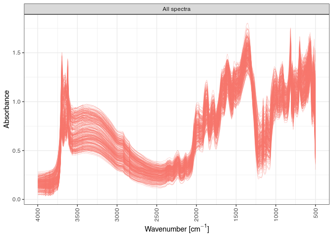

Article
================
Philipp Baumann
2019-12-01

# Intro

Albert Einstein would probably not have felt the necessity for
simplerspec, as he would have followed his quote *“Everything should be
made as simple as possible, but not simpler”*. In line with this
recommendation, I was told that spectral analysis in R is standard
practice and straight forward using the famous partial least squares
(PLS) regression when I started my MSc back in July 2015. I was given
the honour of the exiting task to sample and model both soils and yam
plants from 20 fields at 4 landscapes across the West African yam belt
(see [here](www.yamsys.org) for details). Since I was both fascinated by
R, statistics, soils, and their interplay with plants, I started my
first scientific journey with the premise that I just had to deepen a
bit my R knowledge. I thought that the tools out there are simple enough
for achieving my neat MSc task.

Being a big fan of R and other open source tools, I was happy to find
quite a bit of chemometrics and other modeling toolsets, many of them
for example available via [CRAN](https://cran.r-project.org/) and listed
in the CRAN Task View [Chemometrics and Computational
Physics](https://cran.r-project.org/web/views/ChemPhys.html) or [Machine
Learning & Statistical
Learning](https://cran.r-project.org/web/views/MachineLearning.html). I
would opinionately consider most of them good at solving single tasks,
but I somehow missed a clean common interface that interlinked the key
steps required for spectral processing and modeling. While doing first
analysis steps, my intuition told me that streamlining all analysis
steps would be aiding in more efficiently estimating the composition and
properties of natural materials. And more importantly, I would allow a
sustainable basis for model development and sharing with collaborators.

However, I was far from being there (now still). Soon I realized that
while extending explorations of various options along modeling steps,
such as pre-processing to achieve robust and accurate models, I ended up
writing more and more verbose code for repetitive or only slighly
different tasks. I felt I could do better at some point and get rid of
the verbose boilerplate coding I was doing. To solve this more
elegantly, I started continously building the simplerspec package with
the goal of delivering beginner-friendly and standardized functions. In
short, to provide a rapid prototyping pipeline for various spectroscopy
applications that share common tasks.

# Prepare the R environment for spectral analysis

Enough of the personal talking, let’s start. To reproduce the entire
analysis in this hands-on, I would advise two main procedures:

1.  Installing exact package versions and sources using the renv package
    and the snapshot file `renv.lock`
2.  Manual installation of R packages with specific version tags

To restore and reproduce this entire analysis and document, first clone
this repository to your local computer. Then install renv and restore R
packages based on the `renv.lock` file in an isolated project library in
two lines of code.

``` r
## Option 1 for installation
install.packages("renv")
renv::restore("renv.lock")
```

Option 1 is probably the easiest as it makes automatically sure that all
dependencies are met and the computational environment is the same.

To install and attach all required R packages used in this article with
more manual care and less guarantees, you can run the following lines:

``` r
## Option 2 for installation
pkgs <- c("here", "simplerspec", "tidyverse", "data.table",
  "future", "doFuture")
new_pkgs <- pkgs[!(pkgs %in% installed.packages()[, "Package"])]
# Install only new packages
if (length(new_pkgs)) {
  if ("remotes" %in% new_pkgs) install.packages("remotes")
  if ("simplerspec" %in% new_pkgs) {
    remotes::install_github("philipp-baumann/simplerspec")}
  install.packages(new_pkgs)
}
```

# Hands-on

Now we are ready to proceed to the fundamentals of the package. First,
let’s load required packages. The tidyverse is optional, so if you feel
it is not required you won’t need to load it.

``` r
# Load required packages
# `walk()` is like `lapply()`, but returns invisibly
suppressPackageStartupMessages(
  purrr::walk(pkgs, library, character.only = TRUE, quietly = TRUE)
)
```

A typical simple spectroscopy modeling project has the following
components:

1.  Soil sampling and sample preparation

2.  Spectral measurements

3.  Selection of calibration samples

4.  Soil analytical reference analyses

5.  1.  Calibration or Recalibration
    2.  Estimation of properties of new soils based on new spectra and
        established models.

Simplerspec focuses on the key tasks and provides user-friendly modules
in the form of a standardized function pipeline. This pipeline builds
upon common design principles of spectral R objects which are shared
between function inputs and outputs.

First, you may want to read files from spectra that you measured on your
spectrometer. Spectral inputting is the first step done when doing
spectral analysis prior the standard chemical analysis. This is useful
when you have a lot of samples and you want to save some time and money
to to do reference analysis, and then predict the remaining samples only
with infrared spectroscopy.

Here we read from a Bruker Alpha mid-Infrared spectrometer:

``` r
plan(multisession)
registerDoFuture()
availableCores()
```

    ## system 
    ##      8

``` r
# files to read
files_spc <- list.files(
  here("data", "spectra", "example-yamsys"), full.names = TRUE)
# one example file
files_spc[[1]]
```

    ## [1] "/media/ssd/nas-ethz/doktorat/projects/04_communication/simplerspec-pedometron-article/data/spectra/example-yamsys/BF_lo_01_soil_cal.0"

``` r
# read the files
suppressMessages(
  spc_list <- read_opus_univ(fnames = files_spc, extract = c("spc"), 
    parallel = TRUE)
)
length(spc_list)
```

    ## [1] 284

``` r
names(spc_list[[1]])
```

    ##  [1] "metadata"          "spc"               "spc_nocomp"       
    ##  [4] "sc_sm"             "sc_rf"             "ig_sm"            
    ##  [7] "ig_rf"             "wavenumbers"       "wavenumbers_sc_sm"
    ## [10] "wavenumbers_sc_rf"

Typically, list information is nicely ordered, however printing is
really verbose. Therefore, we can gather the list into a so-called
spectral tibble (`spc_tbl`).

``` r
# Gather from list into tibble data.frame
(spc_tbl <- 
  spc_list %>%
  gather_spc())
```

    ## # A tibble: 284 x 6
    ##    unique_id        file_id    sample_id   metadata   spc       wavenumbers
    ##    <chr>            <chr>      <chr>       <named li> <named l> <named lis>
    ##  1 BF_lo_01_soil_c… BF_lo_01_… BF_lo_01_s… <tibble [… <df[,171… <dbl [1,71…
    ##  2 BF_lo_01_soil_c… BF_lo_01_… BF_lo_01_s… <tibble [… <df[,171… <dbl [1,71…
    ##  3 BF_lo_01_soil_c… BF_lo_01_… BF_lo_01_s… <tibble [… <df[,171… <dbl [1,71…
    ##  4 BF_lo_02_soil_c… BF_lo_02_… BF_lo_02_s… <tibble [… <df[,171… <dbl [1,71…
    ##  5 BF_lo_02_soil_c… BF_lo_02_… BF_lo_02_s… <tibble [… <df[,171… <dbl [1,71…
    ##  6 BF_lo_02_soil_c… BF_lo_02_… BF_lo_02_s… <tibble [… <df[,171… <dbl [1,71…
    ##  7 BF_lo_03_soil_c… BF_lo_03_… BF_lo_03_s… <tibble [… <df[,171… <dbl [1,71…
    ##  8 BF_lo_03_soil_c… BF_lo_03_… BF_lo_03_s… <tibble [… <df[,171… <dbl [1,71…
    ##  9 BF_lo_03_soil_c… BF_lo_03_… BF_lo_03_s… <tibble [… <df[,171… <dbl [1,71…
    ## 10 BF_lo_04_soil_c… BF_lo_04_… BF_lo_04_s… <tibble [… <df[,171… <dbl [1,71…
    ## # … with 274 more rows

Instead of appending a matrix of spectra as a single column in a
data.frame, spectra in a spectral tibble form a list-column. A
list-column is basically a column ist a list instead of an atomic
vector. With this we can extract this list column of spectra.

``` r
spc_dt <- data.table::rbindlist(spc_tbl$spc)
dim(spc_dt)
```

    ## [1]  284 1716

``` r
class(spc_dt)
```

    ## [1] "data.table" "data.frame"

Let’s plot what we have first:

``` r
spc_tbl %>%
  mutate(
    label_all = "All spectra"
  ) %>%
  plot_spc_ext(
    spc_tbl = ., 
    group_id = "label_all",
    ylab = "Absorbance",
  )
```

<!-- -->

The spectral pre-processing pipeline is what is abstracted in these
basic steps that are commonly done. Simplerspec uses prospectr for key
steps and data.table for simple operations. The following scheme
summarizes the steps.

Resampling refers to create a new a axis interval in spectra.

In a nutshell, preprocessing can be done in one pipeline.

``` r
(spc_proc <- 
  spc_tbl %>%
  resample_spc(wn_lower = 2500, wn_upper = 3996, wn_interval = 2) %>%
  average_spc(by = "sample_id") %>%
  preprocess_spc(select = "sg_1_w21"))
```

    ## # A tibble: 284 x 11
    ##    unique_id file_id sample_id metadata spc   wavenumbers spc_rs
    ##    <chr>     <chr>   <chr>     <list>   <lis> <list>      <list>
    ##  1 BF_lo_01… BF_lo_… BF_lo_01… <tibble… <df[… <dbl [1,71… <df[,…
    ##  2 BF_lo_01… BF_lo_… BF_lo_01… <tibble… <df[… <dbl [1,71… <df[,…
    ##  3 BF_lo_01… BF_lo_… BF_lo_01… <tibble… <df[… <dbl [1,71… <df[,…
    ##  4 BF_lo_02… BF_lo_… BF_lo_02… <tibble… <df[… <dbl [1,71… <df[,…
    ##  5 BF_lo_02… BF_lo_… BF_lo_02… <tibble… <df[… <dbl [1,71… <df[,…
    ##  6 BF_lo_02… BF_lo_… BF_lo_02… <tibble… <df[… <dbl [1,71… <df[,…
    ##  7 BF_lo_03… BF_lo_… BF_lo_03… <tibble… <df[… <dbl [1,71… <df[,…
    ##  8 BF_lo_03… BF_lo_… BF_lo_03… <tibble… <df[… <dbl [1,71… <df[,…
    ##  9 BF_lo_03… BF_lo_… BF_lo_03… <tibble… <df[… <dbl [1,71… <df[,…
    ## 10 BF_lo_04… BF_lo_… BF_lo_04… <tibble… <df[… <dbl [1,71… <df[,…
    ## # … with 274 more rows, and 4 more variables: wavenumbers_rs <list>,
    ## #   spc_mean <list>, spc_pre <list>, xvalues_pre <list>

After preprocessing, we can proceed with selecting reference analytical
samples based on
    Kennard-Stone.

``` r
(spc_tbl_ref <- select_ref_spc(spc_tbl = spc_proc, ratio_ref = 0.5))
```

    ## Warning: Prefixing `UQ()` with the rlang namespace is deprecated as of rlang 0.3.0.
    ## Please use the non-prefixed form or `!!` instead.
    ## 
    ##   # Bad:
    ##   rlang::expr(mean(rlang::UQ(var) * 100))
    ## 
    ##   # Ok:
    ##   rlang::expr(mean(UQ(var) * 100))
    ## 
    ##   # Good:
    ##   rlang::expr(mean(!!var * 100))
    ## 
    ## This warning is displayed once per session.

    ## $spc_ref
    ## # A tibble: 47 x 11
    ## # Groups:   sample_id [47]
    ##    unique_id file_id sample_id metadata spc   wavenumbers spc_rs
    ##    <chr>     <chr>   <chr>     <list>   <lis> <list>      <list>
    ##  1 CI_sb_YA… CI_sb_… CI_sb_YA… <tibble… <df[… <dbl [1,71… <df[,…
    ##  2 CI_sb_04… CI_sb_… CI_sb_04… <tibble… <df[… <dbl [1,71… <df[,…
    ##  3 BF_mo_06… BF_mo_… BF_mo_06… <tibble… <df[… <dbl [1,71… <df[,…
    ##  4 CI_tb_07… CI_tb_… CI_tb_07… <tibble… <df[… <dbl [1,71… <df[,…
    ##  5 CI_tb_04… CI_tb_… CI_tb_04… <tibble… <df[… <dbl [1,71… <df[,…
    ##  6 CI_tb_15… CI_tb_… CI_tb_15… <tibble… <df[… <dbl [1,71… <df[,…
    ##  7 CI_sb_YA… CI_sb_… CI_sb_YA… <tibble… <df[… <dbl [1,71… <df[,…
    ##  8 CI_sb_YA… CI_sb_… CI_sb_YA… <tibble… <df[… <dbl [1,71… <df[,…
    ##  9 CI_sb_01… CI_sb_… CI_sb_01… <tibble… <df[… <dbl [1,71… <df[,…
    ## 10 BF_mo_04… BF_mo_… BF_mo_04… <tibble… <df[… <dbl [1,71… <df[,…
    ## # … with 37 more rows, and 4 more variables: wavenumbers_rs <list>,
    ## #   spc_mean <list>, spc_pre <list>, xvalues_pre <list>
    ## 
    ## $spc_pred
    ## # A tibble: 47 x 11
    ## # Groups:   sample_id [47]
    ##    unique_id file_id sample_id metadata spc   wavenumbers spc_rs
    ##    <chr>     <chr>   <chr>     <list>   <lis> <list>      <list>
    ##  1 BF_lo_02… BF_lo_… BF_lo_02… <tibble… <df[… <dbl [1,71… <df[,…
    ##  2 BF_lo_03… BF_lo_… BF_lo_03… <tibble… <df[… <dbl [1,71… <df[,…
    ##  3 BF_lo_04… BF_lo_… BF_lo_04… <tibble… <df[… <dbl [1,71… <df[,…
    ##  4 BF_lo_05… BF_lo_… BF_lo_05… <tibble… <df[… <dbl [1,71… <df[,…
    ##  5 BF_lo_06… BF_lo_… BF_lo_06… <tibble… <df[… <dbl [1,71… <df[,…
    ##  6 BF_lo_07… BF_lo_… BF_lo_07… <tibble… <df[… <dbl [1,71… <df[,…
    ##  7 BF_lo_08… BF_lo_… BF_lo_08… <tibble… <df[… <dbl [1,71… <df[,…
    ##  8 BF_lo_10… BF_lo_… BF_lo_10… <tibble… <df[… <dbl [1,71… <df[,…
    ##  9 BF_lo_14… BF_lo_… BF_lo_14… <tibble… <df[… <dbl [1,71… <df[,…
    ## 10 BF_lo_15… BF_lo_… BF_lo_15… <tibble… <df[… <dbl [1,71… <df[,…
    ## # … with 37 more rows, and 4 more variables: wavenumbers_rs <list>,
    ## #   spc_mean <list>, spc_pre <list>, xvalues_pre <list>
    ## 
    ## $p_pca

<!-- -->

    ## 
    ## $pc_scores
    ##                 PC1          PC2
    ##  [1,] -0.6180733385 -1.652090410
    ##  [2,] -0.5817765669 -0.489872147
    ##  [3,] -0.2514607326 -1.276948372
    ##  [4,] -0.7199752436 -1.557094218
    ##  [5,] -0.6385613963 -0.760451775
    ##  [6,] -0.1978927875 -0.669902042
    ##  [7,] -0.6946923298 -1.508329449
    ##  [8,] -0.1966796209 -0.761322932
    ##  [9,] -0.0638351317 -0.811931866
    ## [10,] -0.1605227960 -0.898817575
    ## [11,] -0.1108427140 -0.380328796
    ## [12,] -0.6249804630 -0.938660908
    ## [13,] -1.1210399250 -1.413531511
    ## [14,]  0.1841560148 -0.944871581
    ## [15,] -0.1540085593 -0.685250722
    ## [16,]  0.2273297399  0.037879189
    ## [17,] -0.5398109747 -1.704908900
    ## [18,] -0.3852672781 -1.200035276
    ## [19,] -0.4712897887 -0.526678196
    ## [20,] -0.0213673372 -0.372000222
    ## [21,]  0.9236654990 -0.564925491
    ## [22,] -0.8702493207 -0.780642867
    ## [23,]  0.0577827946 -1.425707855
    ## [24,] -1.0457019252  0.397314556
    ## [25,] -0.5175997061 -1.611276656
    ## [26,] -0.0395646578 -1.658853030
    ## [27,] -0.5150981433 -0.555244785
    ## [28,]  0.5146815792 -0.704948552
    ## [29,]  0.0926928918 -0.875407659
    ## [30,]  0.4699897652 -1.708535956
    ## [31,]  1.3490790322 -0.387324920
    ## [32,]  1.1456854202 -0.109434207
    ## [33,] -0.1734814034 -0.882591601
    ## [34,]  0.3044414808 -0.985588304
    ## [35,]  1.7509641578 -0.346305047
    ## [36,]  1.3496960996  0.373983590
    ## [37,]  1.0151307002 -0.272824268
    ## [38,]  1.6736995217 -0.400621176
    ## [39,]  0.0766970477  0.669925476
    ## [40,]  0.4576446351  0.079036601
    ## [41,]  1.1322142839  2.044810882
    ## [42,]  0.4509842685  0.682741759
    ## [43,] -1.4554179638  0.101526178
    ## [44,] -2.4576162183  0.575550599
    ## [45,] -1.8140041064  0.639172392
    ## [46,] -1.9953090693  0.226972012
    ## [47,] -1.0241905493  0.826629223
    ## [48,] -1.6914437458  0.694177812
    ## [49,]  0.3238405553 -0.356890019
    ## [50,] -1.9575763163  0.000873119
    ## [51,]  0.8997995972 -0.135052418
    ## [52,]  1.1214882759 -0.437704756
    ## [53,]  0.5237763611 -0.508593369
    ## [54,] -1.4709034149 -0.262087354
    ## [55,]  1.0504111149  0.386517072
    ## [56,]  1.6789274008 -0.413040294
    ## [57,] -0.5766433875  0.360725069
    ## [58,] -0.2815322253  0.795893570
    ## [59,]  1.6931162933 -0.185242823
    ## [60,]  1.2058930352  0.121408015
    ## [61,]  1.1092045532  1.291009583
    ## [62,] -1.2851594869 -0.636276980
    ## [63,] -0.9928674572 -0.375251503
    ## [64,] -1.7508909869  0.465187418
    ## [65,]  0.0387864236  0.659247481
    ## [66,]  0.6693729862  1.801256264
    ## [67,] -0.5910952313  1.917280817
    ## [68,] -0.7803625929  0.877345232
    ## [69,]  1.5740963096  0.276765761
    ## [70,]  2.1788566530  0.997022070
    ## [71,] -1.3827501595  1.671324582
    ## [72,] -1.4591996857  0.829545966
    ## [73,]  0.6960380693  0.233119013
    ## [74,]  1.4109424695  0.946104560
    ## [75,] -0.3645794520  0.060548488
    ## [76,] -1.0057585496  0.573025254
    ## [77,]  1.2364780336  0.041548668
    ## [78,] -0.0009663169  0.637169832
    ## [79,]  0.1404966191  2.209796891
    ## [80,]  0.8683798405 -0.071992336
    ## [81,]  0.2028538785  2.781048036
    ## [82,] -0.5687899076  1.357960010
    ## [83,]  1.2638314990 -0.588676873
    ## [84,] -0.1808932839  1.475596059
    ## [85,]  0.3849300945 -0.436806528
    ## [86,]  1.0657105942 -0.143223365
    ## [87,] -1.0611743389  0.647941983
    ## [88,] -0.3006561637 -0.187205146
    ## [89,]  1.4020976559 -0.533710223
    ## [90,]  1.3218206912 -0.236961509
    ## [91,] -0.2420272912  0.985397789
    ## [92,]  0.6243439290  1.013374449
    ## [93,] -0.4821186620  2.183377687
    ## [94,]  0.0256708372  2.384843763

# Outro

Simplerspec are some first baby steps in spectral adventures. It would
be great to further develop streamlining packages which are good at
doing single things. It would also be fantastic to co-develop a new set
of programs that automatically tune spectral machine learning pipelines.
If you have ideas, just send me an email or interact via github.
