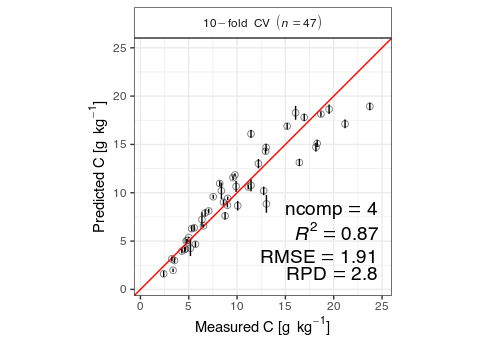

Article
================
Philipp Baumann | <philipp.baumann@usys.ethz.ch>
2019-12-01

# Intro

Albert Einstein would probably not have felt the necessity for
simplerspec, as he would have followed his quote *“Everything should be
made as simple as possible, but not simpler”*. In line with this
recommendation, I was told that spectral analysis in R is standard
practice and straight forward using the famous partial least squares
(PLS) regression when I started my MSc back in July 2015. I was given
the honour of the exciting task to sample and model both soils and yam
plants from 20 fields in 4 landscapes across the West African yam belt
(see [here](http://yamsys.org) for details). Since I was both fascinated
by R, statistics, soils, and their interplay with plants, I started my
first scientific journey with the premise that I just had to deepen a
bit my R knowledge. I thought that the tools out there are simple enough
for achieving my neat MSc task.

Being a big fan of R and other open source tools, I was happy to find
quite a bit of chemometrics and other modeling toolsets, many of them
for example available via [CRAN](https://cran.r-project.org/) and listed
in the CRAN Task View [Chemometrics and Computational
Physics](https://cran.r-project.org/web/views/ChemPhys.html) or [Machine
Learning & Statistical
Learning](https://cran.r-project.org/web/views/MachineLearning.html). I
would consider most of them good at solving single tasks, but I somehow
missed a clean common interface that interlinked the key steps required
for spectral processing and modeling. While doing first analysis steps,
my intuition told me that streamlining all analysis steps would aid in
more efficiently estimating the composition and properties of natural
materials. More importantly, it would allow a sustainable basis for
model development and sharing with collaborators.

However, I was far from being there (now still). Soon I realized that
while extending explorations of various options along modeling steps,
such as pre-processing to achieve robust and accurate models, I ended up
writing more and more verbose code for repetitive or only slighly
different tasks. I felt I could do better at some point and get rid of
the verbose boilerplate coding I was doing. To solve this more
elegantly, I started continously building the simplerspec package with
the goal of delivering beginner-friendly and standardized functions. In
short, to provide a rapid prototyping pipeline for various spectroscopy
applications that share common tasks.

# Prepare the R environment for spectral analysis

Enough of the personal talking, let’s start. To reproduce the entire
analysis in this hands-on, I would advise two main procedures:

1.  Installing exact package versions and sources using the renv package
    and the snapshot file `renv.lock`
2.  Manual installation of R packages with specific version tags

To restore and reproduce this entire analysis and document, first clone
this repository to your local computer. Then install renv and restore R
packages based on the `renv.lock` file in an isolated project library in
two lines of code.

``` r
## Option 1 for installation
install.packages("renv")
renv::restore("renv.lock")
```

Option 1 is probably the easiest as it makes automatically sure that all
dependencies are met and the computational environment is the same
(apart from operating system and system tools).

To install and attach all required R packages used in this article with
more manual care and less guarantees, you can run the following lines:

``` r
## Option 2 for installation
pkgs <- c("simplerspec", "here", "tidyverse", "data.table",
  "future", "doFuture", "remotes")
# install.packages(pkgs)
# remotes::install_github("philipp-baumann/simplerspec")}
```

# Hands-on

Now we are ready to proceed to the fundamentals of the package. We use
the example data set from my MSc thesis. First, let’s load required
packages. The tidyverse is optional, so if you feel it is not required
you won’t need to load it.

``` r
# Load required packages
# `walk()` is like `lapply()`, but returns invisibly
suppressPackageStartupMessages(
  purrr::walk(pkgs, library, character.only = TRUE, quietly = TRUE)
)
```

A typical simple spectroscopy modeling project has the following
components:

1.  Soil sampling and sample preparation

2.  Spectral measurements

3.  Selection of calibration samples

4.  Soil analytical reference analyses

5.  1.  Calibration or Recalibration
    2.  Estimation of properties of new soils based on new spectra and
        established models.

Simplerspec focuses on the key tasks and provides user-friendly modules
in the form of a standardized function pipeline. This pipeline builds
upon common design principles of spectral R objects which are shared
between function inputs and outputs.

``` r
# Read final reference analysis data
# see  ̀data/reference-data/metadata_soilchem_yamsys.txt` for further details
(reference_data <- fread(
  file = here("data", "reference-data", "soilchem_yamsys.csv")) %>%
  as_tibble())
```

    ## # A tibble: 94 x 36
    ##    sample_ID country site  material     S     C     N ex_Ca ex_Mg  ex_K
    ##    <chr>     <chr>   <chr> <chr>    <dbl> <dbl> <dbl> <dbl> <dbl> <dbl>
    ##  1 BF_lo_01… BF      lo    soil      71.3  6.92 0.438  488   62.5 113  
    ##  2 BF_lo_02… BF      lo    soil      87    5.73 0.447  656   47.5 140  
    ##  3 BF_lo_03… BF      lo    soil      72.   3.41 0.233  270   21.9  61.6
    ##  4 BF_lo_04… BF      lo    soil      73    5.37 0.423  532.  49.5 110. 
    ##  5 BF_lo_05… BF      lo    soil      70    9.03 0.624  604   92.6 115  
    ##  6 BF_lo_06… BF      lo    soil      57    3.58 0.276  426   41.8  90.7
    ##  7 BF_lo_07… BF      lo    soil      56    4.66 0.355  321   46    72.9
    ##  8 BF_lo_08… BF      lo    soil      53    4.26 0.315  250   34.1  75.5
    ##  9 BF_lo_09… BF      lo    soil      57    4.30 0.336  375   47    88.5
    ## 10 BF_lo_10… BF      lo    soil      42.0  2.93 0.262  225   31.6 121  
    ## # … with 84 more rows, and 26 more variables: ex_Al <dbl>, ex_Na <dbl>,
    ## #   ex_Fe <dbl>, ex_Mn <dbl>, pH_BaCl2 <dbl>, CEC_eff <dbl>, BS_eff <dbl>,
    ## #   pH <dbl>, P_resin <dbl>, Fe_tot <dbl>, Si_tot <dbl>, Al_tot <dbl>,
    ## #   P_tot <dbl>, K_tot <dbl>, Ca_tot <dbl>, Mn_tot <dbl>, Zn_tot <dbl>,
    ## #   Cu_tot <dbl>, Zn_DTPA <dbl>, Cu_DTPA <dbl>, Fe_DTPA <dbl>,
    ## #   Mn_DTPA <dbl>, sand <dbl>, clay <dbl>, silt <dbl>, site_comb <chr>

First, you may want to read files from spectra that you measured on your
spectrometer. Spectral inputting is the first step done when doing
spectral analysis prior to the standard chemical analysis. This is
useful when you have a lot of samples and you want to save some time and
money to to do reference analysis, and then predict the remaining
samples only with infrared spectroscopy.

Here we read from a Bruker Alpha mid-Infrared spectrometer. Currently,
the package is limited to Bruker and ASD devices, however support for
reading files from other devices and formats is planned within the
package simplerspec.io.

``` r
# multicore would work on UNIX/Darwin, however not supported for RStudio
# and the future package due to stability reasons
plan(multisession)
registerDoFuture()
# availableCores()

# files to read
files_spc <- list.files(
  here("data", "spectra", "example-yamsys"), full.names = TRUE)
# path to one example file
# files_spc[[1]]
# read the files
suppressMessages(
  spc_list <- read_opus_univ(fnames = files_spc, extract = c("spc"),
    parallel = TRUE)
)
length(spc_list)
```

    ## [1] 284

``` r
names(spc_list[[1]])
```

    ##  [1] "metadata"          "spc"               "spc_nocomp"       
    ##  [4] "sc_sm"             "sc_rf"             "ig_sm"            
    ##  [7] "ig_rf"             "wavenumbers"       "wavenumbers_sc_sm"
    ## [10] "wavenumbers_sc_rf"

Typically, list information is nicely ordered, however printing is
really verbose. Therefore, we can gather the list into a so-called
spectral tibble (`spc_tbl`).

``` r
# Gather from list into tibble data.frame
(spc_tbl <- 
  spc_list %>%
  gather_spc())
```

    ## # A tibble: 284 x 6
    ##    unique_id        file_id    sample_id   metadata   spc       wavenumbers
    ##    <chr>            <chr>      <chr>       <named li> <named l> <named lis>
    ##  1 BF_lo_01_soil_c… BF_lo_01_… BF_lo_01_s… <tibble [… <df[,171… <dbl [1,71…
    ##  2 BF_lo_01_soil_c… BF_lo_01_… BF_lo_01_s… <tibble [… <df[,171… <dbl [1,71…
    ##  3 BF_lo_01_soil_c… BF_lo_01_… BF_lo_01_s… <tibble [… <df[,171… <dbl [1,71…
    ##  4 BF_lo_02_soil_c… BF_lo_02_… BF_lo_02_s… <tibble [… <df[,171… <dbl [1,71…
    ##  5 BF_lo_02_soil_c… BF_lo_02_… BF_lo_02_s… <tibble [… <df[,171… <dbl [1,71…
    ##  6 BF_lo_02_soil_c… BF_lo_02_… BF_lo_02_s… <tibble [… <df[,171… <dbl [1,71…
    ##  7 BF_lo_03_soil_c… BF_lo_03_… BF_lo_03_s… <tibble [… <df[,171… <dbl [1,71…
    ##  8 BF_lo_03_soil_c… BF_lo_03_… BF_lo_03_s… <tibble [… <df[,171… <dbl [1,71…
    ##  9 BF_lo_03_soil_c… BF_lo_03_… BF_lo_03_s… <tibble [… <df[,171… <dbl [1,71…
    ## 10 BF_lo_04_soil_c… BF_lo_04_… BF_lo_04_s… <tibble [… <df[,171… <dbl [1,71…
    ## # … with 274 more rows

Instead of appending a matrix of spectra as a single column in a
data.frame, spectra in a spectral tibble form a list-column. A
list-column is basically a column consisting of a list instead of an
atomic vector. With this we can extract this list column of spectra.

``` r
spc_dt <- data.table::rbindlist(spc_tbl$spc)
dim(spc_dt); class(spc_dt)
```

    ## [1]  284 1716

    ## [1] "data.table" "data.frame"

Let’s plot what we have first:

``` r
spc_tbl %>%
  mutate(
    label_all = "All spectra"
  ) %>%
  plot_spc_ext(
    spc_tbl = ., 
    group_id = "label_all",
    ylab = "Absorbance"
  )
```


The spectral pre-processing pipeline of simplerspec comprises basic
steps that are often performed for spectral modeling and estimation.
Simplerspec uses prospectr for key steps and data.table for simple
operations. The following scheme summarizes the steps.

Resampling in this contexts refers to to creating a new a axis interval
in spectra.

In a nutshell, spectral data processing can be done in one pipeline.

``` r
spc_proc <- 
  spc_tbl %>%
  resample_spc(wn_lower = 2500, wn_upper = 3996, wn_interval = 2) %>%
  average_spc(by = "sample_id") %>%
  preprocess_spc(select = "sg_1_w21")

colnames(spc_proc)
```

    ##  [1] "unique_id"      "file_id"        "sample_id"      "metadata"      
    ##  [5] "spc"            "wavenumbers"    "spc_rs"         "wavenumbers_rs"
    ##  [9] "spc_mean"       "spc_pre"        "xvalues_pre"

We can explore the final processed spectra.

``` r
spc_proc %>%
  inner_join(
    x = .,
    y = reference_data %>% rename(sample_id = sample_ID)
  ) %>%
  plot_spc_ext(
    spc_tbl = .,
    lcols_spc = c("spc", "spc_pre"),
    lcol_measure = "C",
    group_id = "site")
```

    ## Joining, by = "sample_id"

<!-- -->

After preprocessing, we can proceed with selecting reference analytical
samples based on Kennard-Stone.

``` r
spc_tbl_selection <- select_ref_spc(spc_tbl = spc_proc, ratio_ref = 0.5)
# PCA biplot
spc_tbl_selection$p_pca
```

<!-- --> Lastly, we
develop a partial least squares (PLS) calibration model.

``` r
# Fuse spectra and reference data
spc_refdata <- 
  dplyr::inner_join(
    x = spc_proc,
    y = reference_data %>% rename(sample_id = sample_ID)
  )
```

    ## Joining, by = "sample_id"

``` r
spc_refdata %>%
  skimr::skim(starts_with("spc"))
```

|                                                  |            |
| :----------------------------------------------- | :--------- |
| Name                                             | Piped data |
| Number of rows                                   | 284        |
| Number of columns                                | 46         |
| \_\_\_\_\_\_\_\_\_\_\_\_\_\_\_\_\_\_\_\_\_\_\_   |            |
| Column type frequency:                           |            |
| list                                             | 4          |
| \_\_\_\_\_\_\_\_\_\_\_\_\_\_\_\_\_\_\_\_\_\_\_\_ |            |
| Group variables                                  | None       |

Data summary

**Variable type:
list**

| skim\_variable | n\_missing | complete\_rate | n\_unique | min\_length | max\_length |
| :------------- | ---------: | -------------: | --------: | ----------: | ----------: |
| spc            |          0 |              1 |       284 |        1716 |        1716 |
| spc\_rs        |          0 |              1 |       284 |         749 |         749 |
| spc\_mean      |          0 |              1 |        94 |         749 |         749 |
| spc\_pre       |          0 |              1 |        94 |         729 |         729 |

``` r
pls_carbon <- fit_pls(spec_chem = spc_refdata, response = C,
  evaluation_method = "resampling", print = FALSE)
```

    ## Adding missing grouping variables: `sample_id`

<!-- -->

``` r
pls_carbon$p_model +
  xlab(expression(paste("Measured C [g", ~kg^-1))) +
  ylab(expression(paste("Predicted C [g", ~kg^-1)))
```

<!-- -->

# Outro

Simplerspec are some first baby steps in spectral adventures. The
package deals with simplifying standard tasks and now has mainly
exploration and teaching purposes. As an example, the [Congo spectral
platform](https://sae-interactive-data.ethz.ch/simplerspec.drc/) uses
some of its functionality. It would be great to further develop
streamlining packages which are good at doing single things. It would
also be fantastic to co-develop a new set of programs that automatically
tune spectral machine learning pipelines. Complex problems require
targeted learning. For example, one could create a custom graph learner
using mlr3 and a preprocessing wrapper targeted to spectral analysis, in
connection with a proper database system. If you have ideas, just send
me an email or interact via github. Last but not least, I would like to
give a big thanks to my generous supervisor for providing me infinite
freedom in my science bubble. A big thank goes also to my main advisor
and many more part and full-time advisors in my PhD committee. Working
without constraints and waking up every day with thinking “alright —
what am I going to do today?” feels amazing.
